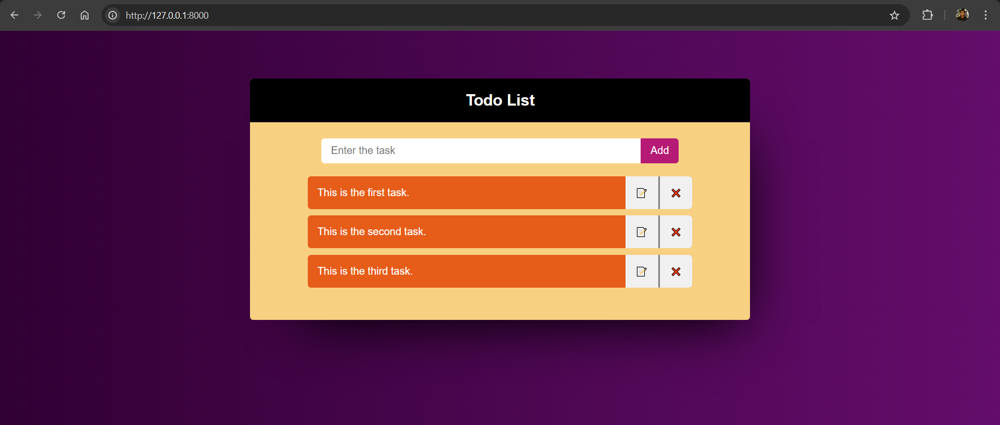

# ✅ Django To-Do App  

  

A simple **To-Do List App** built with **Django** and powered by an **SQLite database**. This app allows users to add, edit, and delete tasks, providing a lightweight solution for task management.  

---

## ✨ Features  

- **📝 Add Tasks**: Quickly add new tasks to your list.  
- **🛠 Edit Tasks**: Update your tasks with ease.  
- **❌ Delete Tasks**: Remove completed or unnecessary tasks.  
- **📄 Task List Overview**: View all your tasks in one place.  

---

## 📂 Installation and Setup  

1. **Clone the Repository**  
   ```bash  
   git clone https://github.com/your-username/todo-app-django.git  
   cd todo-app-django  
   ```  

2. **Install Dependencies**  
   Ensure you have Python and pip installed, then run:  
   ```bash  
   pip install -r requirements.txt  
   ```  

3. **Run Migrations**  
   Apply the database migrations to set up the SQLite database:  
   ```bash  
   python manage.py migrate  
   ```  

4. **Start the Development Server**  
   Launch the app locally:  
   ```bash  
   python manage.py runserver  
   ```  

5. **Access the Application**  
   Open your browser and navigate to `http://127.0.0.1:8000/` to start managing your tasks.  

---

## 🖥️ Project Structure  

### Views (`views.py`)  

- **`index(request)`**: Displays all tasks on the home page.  
- **`addtodo(request)`**: Adds a new task to the to-do list.  
- **`deletetodo(request, id)`**: Deletes a specific task based on its ID.  
- **`edittodo(request, id)`**: Edits the details of a specific task.  

---

## 🔗 Connect  

If you have any feedback or ideas for improving the app, feel free to open an issue or reach out!  

**Enjoy organizing your tasks efficiently!** 🎉  